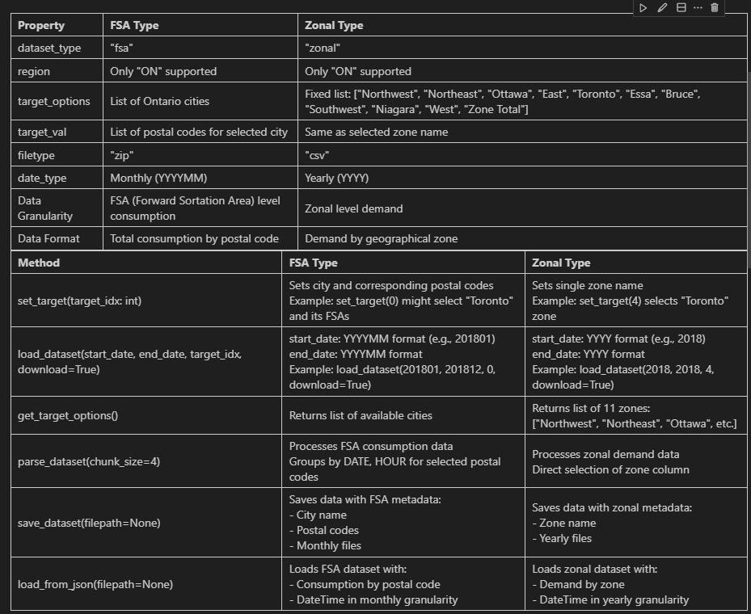
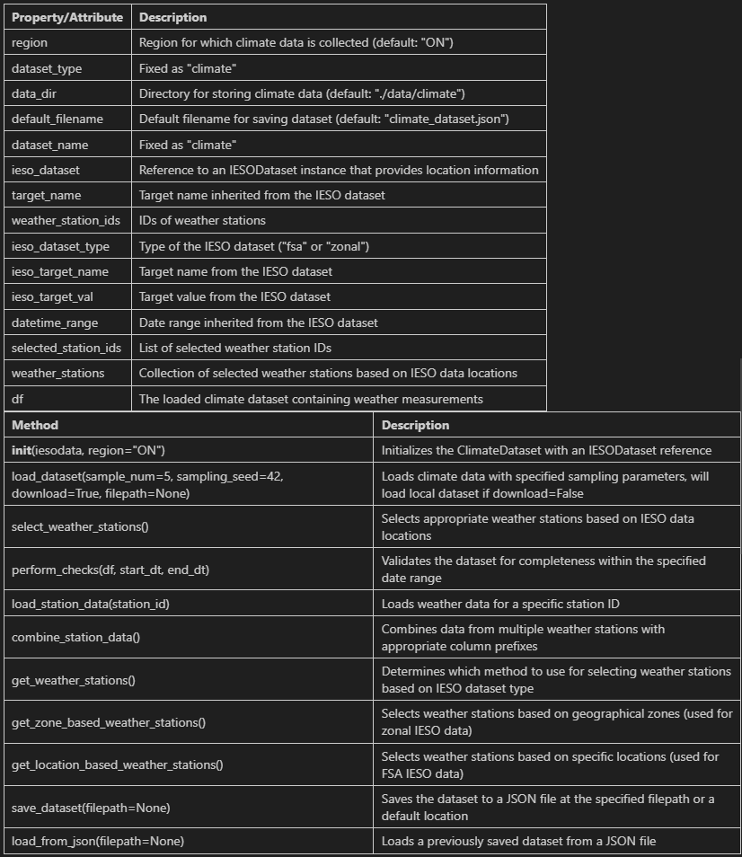
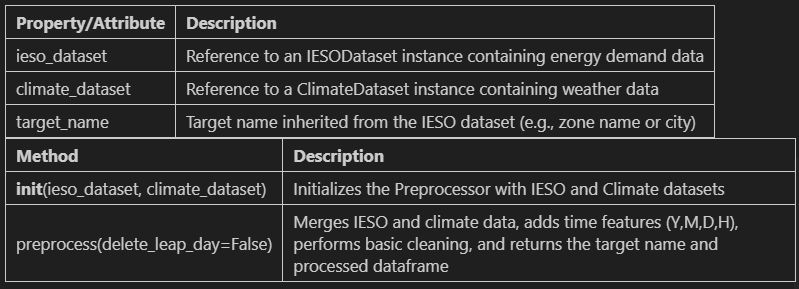
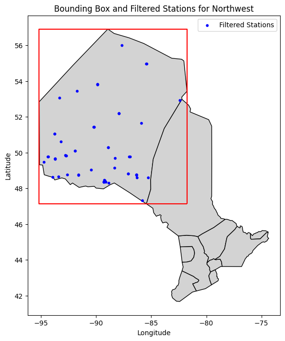
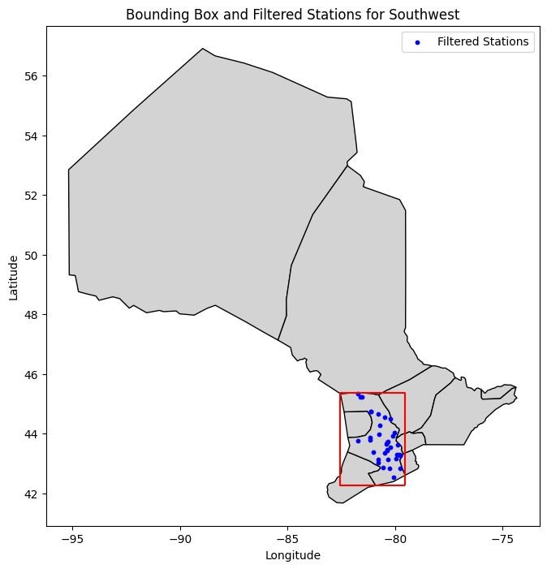

# DataLoaders


1. [IESO](#ieso)
2. [Climate](#climate)
3. [Preprocessor](#preprocessor)
4. [Dataset API Usage/Workflow](#dataset-api-usageworkflow)


## API Reference

### IESO


### Climate



### Preprocessor




## Usage

0. The app loads the API through github
```Python
import urllib.request
api_url = 'https://raw.githubusercontent.com/tanmayyb/ele70_bv03/refs/heads/main/api/datasets.py'
exec(urllib.request.urlopen(api_url).read())
```

### IESO Dataset

1. User chooses which IESO dataset they would like to load (`zonal` or `fsa`), and the app creates the relevant object
```Python
ieso = IESODataset('fsa')
or 
ieso = IESODataset('zonal')
```

2. The API can then be used by the app to give user options for target and datetime range

```Python
target_options = ieso.get_target_options() # returns list of the target options
available_dates = ieso.get_dates() # returns list of available dates (str)
```
Note: the variables above can be used to show user options for target and datetime range

3. App can load the ieso dataset using a load_dataset call
```Python
ieso.load_dataset(start_date=<int>, end_date=<int>, download=True)
```

### Climate Dataset
1. Climate Dataset can be easily created by the app by just passing the ieso dataset
```Python
climate = ClimateDataset(ieso)
```

2. The climate dataset can be loaded using a load_dataset call
```Python
climate.load_dataset(sample_num=5, download=True)
```
Note: The user can also select how many weather stations they would like to sample

### Preprocessor

1. To get the processed dataset for machine learning, the app needs to pass the ieso and climate dataset objects into a preprocessor 
```Python
preprocessor = DatasetPreprocessor(ieso, climate)
target_name, dataset = preprocessor.preprocess()
```

That;s it!


## Algorithms

### Weather Station Sampling Algorithm 

<div style="display: flex;">
  
  
</div>

- Fast filtering for weather station based on zonal bounding box
- More precise filtering done by selecting filtered points within geometric boundary of zones